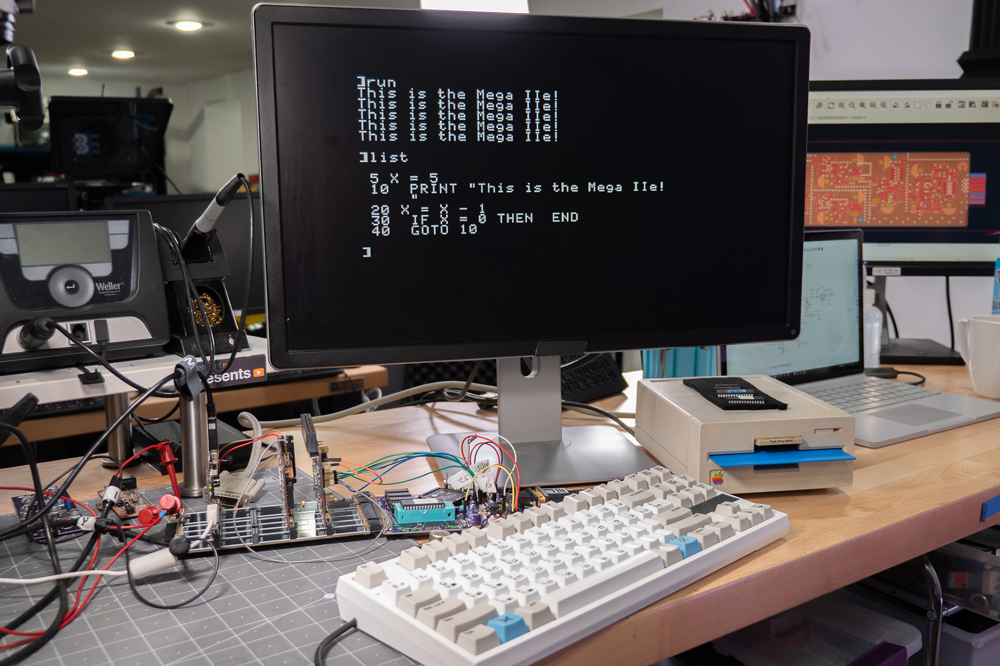
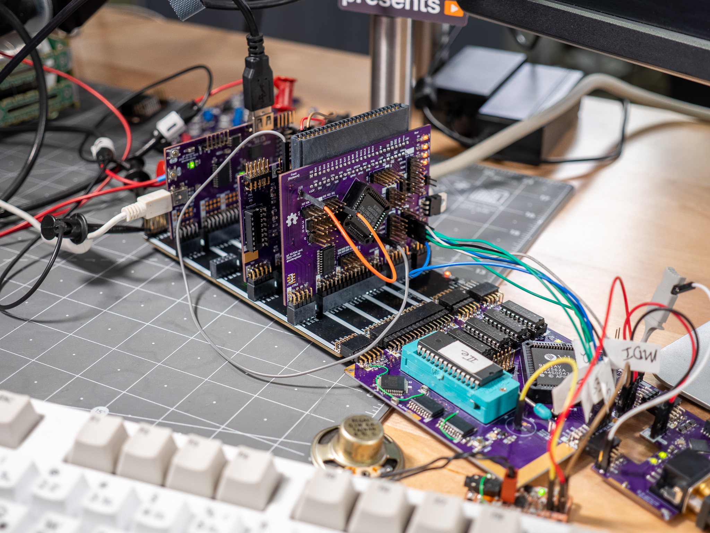

# Golden Delicious

This project started as a portable Apple ][ by using the MEGA II chip from an IIgs. (This chip was also known as the Gemini in the Mac LC compatibility card.) However, it evolved into making a miniture Apple IIe compatible computer.

This project is why I started [Bit Preserve](https://github.com/baldengineer/bit-preserve), a project to archive vintage computer schematics.

## (Off-)Stream Notes 2021-10-02
* Attempting to book the GD with a IIc ROM results in a lock-up.
  * graphics get initialized and the memory is dumped to the screen, but no beep and nothing past that.
  * Logic Analyzer suggests `BASICINIT` is doing a monitor version check in the F8 ROM, but failing. It calls a jump called `HANG`. Even though the 6502 should be jumping in a circle, it seems to keep doing other stuff. (Maybe it is just bus fetches that do nothing?)
* SLOTMAKER Bus Headers on the IO board are pinned out different from the SLOTMAKER Bus Header on the MEGA-65c02. For a ribbon cable, each pin-pair needs to be swapped, except for the last two. They are GND.

## Stream Notes 2021-10-01
Golden Delicious Rev 2 booted! Yay!

* \~DMA is wrong level
  * The two \`245 buffers have their enable pins connnected to \~DMA. I made the mistake of thinking that MEGA drove the \~DMA signal. That is not the case, nor does it make sense after thinking about it. For now, the \`245s have pin 19 lifted and tied to ground to always enable them. 
  * When connecting the IWM or a card to slotmaker, \~DMA situation needs to be resolved.

* [IIe / 6502 decoder](https://discord.com/channels/369243434080272385/843878836471201902/893914917676130314) for Waveforms / Digitial Discovery has been updated. 
* This [forum post](https://discord.com/channels/369243434080272385/843878836471201902/893915436620607488) has Digilent Waveforms beta builds that are downloadable without filling out the annoying registration form. (Or just use `asdf` for all of the fields.)

## Stream Notes 2021-06-02
* Wherefore no IIe ROM in the IIgs? Is it in the MEGA-II?
* [Warphammer: this seciton looks rommy](https://twitter.com/babbageboole/status/1001178057057566720/photo/1)
* rjhelms: that's the big question mark - there could be logic in the Mega II that never actually gets used because the CYA is doing it all in this implementation
* al: keep it all breakouts
* can we decode ROMEN1 and ROMEN2 ourselves?

## Stream Notes 2021-05-19
Things to look at on the scope:
* Composite signal out of the Mega II
* What is Mono-Color from VGC doing to Chroma into MC1377
* Is VGC refreshing apple II DRAM (or is it the Mega)
* why is the 28 MHz oscillator enabled/disabled from the VGC's !SYNC pin?
* [PLCC Pinout Page](https://www.sbprojects.net/knowledge/footprints/plcc/index.php)

### Renesas / IDT OSC: XLH735028.636360I 
* XL H 7 3 5 0 28.636360 I 
  * XL = 1,000,000 af
  * H = LVCMOS En/Dis Pin 1
  * 7 = 7.0 x 5.0 mm
  * 3 = 3.3 VDC
  * 5 = 100ppm for -40C to 105C only on tuesdays when the moon is full and it hasn't rained for a few days. also if you ate green skittles recently *Note1*

### BoM for Protoboards
* [Possible MC1377 Source](https://www.ebay.com/itm/192523168043?hash=item2cd346692b:g:BgIAAOSwWfda4kj6)

## Stream Notes 2021-05-16
* [WDC Application note on using 65C02 in Apple II and other old systems](https://www.westerndesigncenter.com/wdc/AN-002_W65C02S_Replacements.php)
* [65C02 Datasheet](https://www.westerndesigncenter.com/wdc/documentation/w65c02s.pdf)

## Bald Engineer Live Stream
Watch the stream and help out in chat here:
https://twitch.tv/baldengineer
