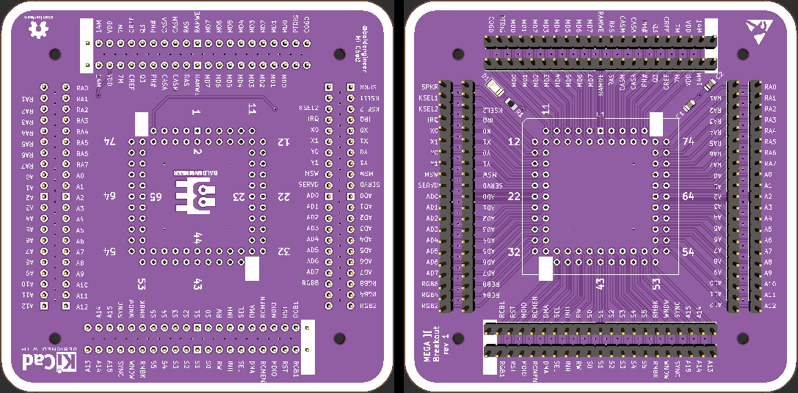

# Golden Delicious

Creating a portable Apple ][ by using the MEGA II chip from an IIgs. (This chip was also known as the Gemini in the Mac LC compatibility card.)

This project is why I started [Bit Preserve](https://github.com/baldengineer/bit-preserve), a project to archive vintage computer schematics.

## Stream Notes 2021-05-19
Things to look at on the scope:
* Composite signal out of the Mega II
* What is Mono-Color from VGC doing to Chroma into MC1377
* Is VGC refreshing apple II DRAM (or is it the Mega)
* why is the 28 MHz oscillator enabled/disabled from the VGC's !SYNC pin?
* [PLCC Pinout Page](https://www.sbprojects.net/knowledge/footprints/plcc/index.php)

### Renesas / IDT OSC: XLH735028.636360I 
* XL H 7 3 5 0 28.636360 I 
** XL = 1,000,000 af
** H = LVCMOS En/Dis Pin 1
** 7 = 7.0 x 5.0 mm
** 3 = 3.3 VDC
** 5 = 100ppm for -40C to 105C only on tuesdays when the moon is full and it hasn't rained for a few days. also if you ate green skittles recently *Note1*

### BoM for Protoboards
* [Possible MC1377 Source](https://www.ebay.com/itm/192523168043?hash=item2cd346692b:g:BgIAAOSwWfda4kj6)

## Stream Notes 2021-05-16
* [WDC Application note on using 65C02 in Apple II and other old systems](https://www.westerndesigncenter.com/wdc/AN-002_W65C02S_Replacements.php)
* [65C02 Datasheet](https://www.westerndesigncenter.com/wdc/documentation/w65c02s.pdf)

## Bald Engineer Live Stream
Watch the stream and help out in chat here:
https://twitch.tv/baldengineer