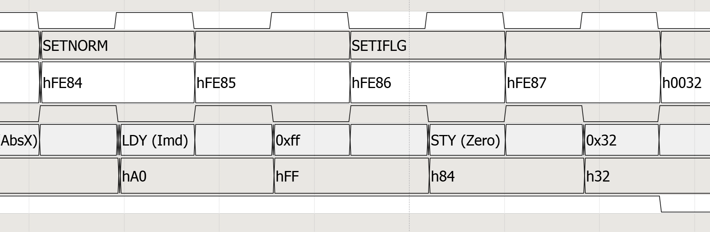
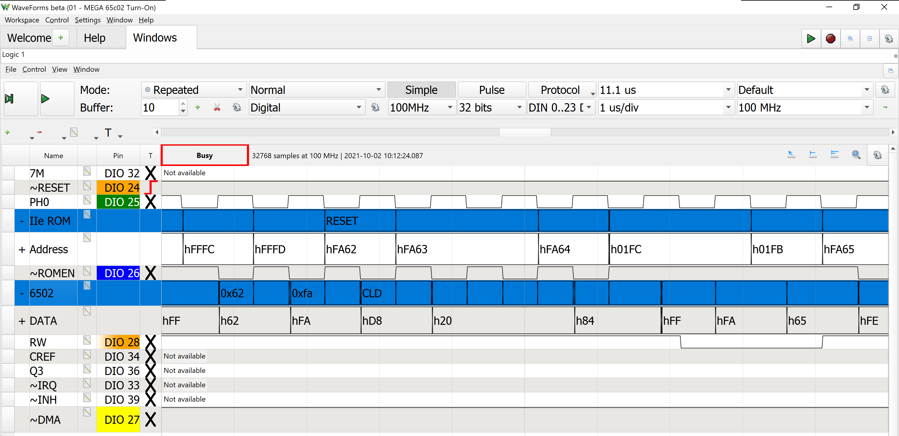
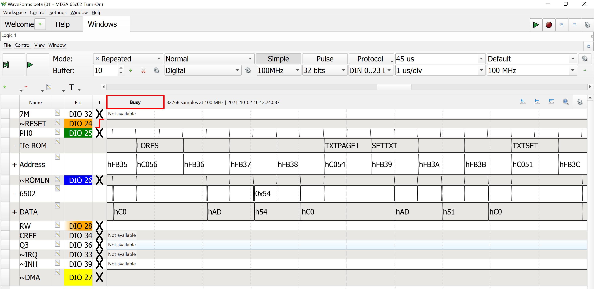

# Waveforms Decoders

### Here is the good news: 
These code chunks can decode 6502 op codes and labels from the Apple IIe ROM.

### Here is the bad news: 
It is very poorly written and breaks easy.

## What you need:
* Digilent Digital Discovery 
 * Address and Data needs 24 channels, Analog Discovery 2 only has 15. But if you only wanted one or the other you could look at either Address or Data.

* Waveforms
 * Software that runs the Digital Discovery.
 * This code uses version 3.16.41.

* A way probe address and databus
 * For the [Golden Delicious Project](https://github.com/baldengineer/golden-delicious) we built a custom backplane that the Digital Discovery plugs into.

* For 6502 decode you need ROMEN signal
 * Currently, I use ROMEN because it is available on the MEGA chip. However, the decoder should use and rely on SYNC from the 6502. 
  * FYI, the 6502's SYNC is not related to the video SYNC signal found in the Apple II design

* For IIe ROM Decode, no extra signals are needed
 * Waveforms can use the clock to clean-up states, but I found that to be harder to follow.

## How to use these files:
If you have never written a Waveforms custom decoder, then be ready for some problems. It is finicky to get set up. So here is what I suggest you try.

### Setting up Waveforms Logic Analyzer Notes
First, configure the Logic Analyzer in Waveforms to have the Address and Data bus. I found setting the bus to display in HEX to be easiest to read. To make sure you have your bits setup correctly, trigger on a RESET signal. After 6 or 7 clocks you should see the 6502 attempt to read from 0xFFFC followed by 0xFFFD. The values on the data bus are the low byte and then the high byte of the RESET vector.

In the case of the Apple IIe ROM, the data bytes are 0x62 followed by 0xFA which means the next read should be to 0xFA62. (If you aren't decoding an Apple II ROM, then that vector will be different)

Once your address (and/or) data bus is setup, then add a CUSTOM (bus?). A dialog opens up with with two tabs.

### Setting up the CUSTOM Decoder
It may not be obvious, but the custom decoder essentially ignores all of your labels. The basic example iterates through every sample the logic analyzer took and analyzes the "word" that it sampled. For example, if you are setup to capture 32-bits, your words will be 32-bits. 

If your bits are cleanly going from LSB to MSB and bits 0 to 15 then the decoder is a bit easier to setup. In my case, the bits for both address and data were swizzled. These decoders "de-swizzle" the bits.

### Using the Javascript files
Each of the JavaScript files has two functions in them. One goes into the "Decoder" tab and the other goes into the Value To Text tab. The Value To Text code is a massic switch statement, so make sure you carefully copy the braces at the end.

In both files there is an array called `la_bits`. Give that array the sequential order of Address or Data bits. Depending on how you connect the logic analyzer, you might have to reverse that order to get the decode to work correctly.

In the Value to Text tab/code, there is a return statement commented out. Enabling this statement will cause the CUSTOM decoder to return the value it decoded in HEX. Those HEX values should match what the logic analyzer captured. If not, try reversing the order of your `la_bits` array.

#### Apple IIe ROM Decoder.js
This decoder operates on the 16 bit address bus for the 6502. The Value to Text tab/code has the ROM's symbol table. The decoder has no idea if any part of ROM gets bank switched out so you must use judgement on whether the decode is valid.

#### 6502 decoder.js
Currently this decoder uses the Apple IIe/IIc's/MEGA "ROMEN" signal to determine if a data value is during a code read. The correct method would be to use the 6502's SYNC signal. 

This decoder does have a variable for the ROMEN signal that you must set. Just give it the input number of the logic analyzer. 

## RESET Decode Example
Notice the 6052 RESET sequence: 
* 0xFFFC fetches 0x62 from ROM
* 0xFFFD fetches 0xFA from ROM
* Then a few cycles later, the 6502 jumps to 0xFA62

(Remember *this* specific ROM jumps to 0xFA62. Match the values the LA sees!)

## Random Apple IIe ROM Decode Example
Just a random part of the Apple IIe boot sequence. Here you can see it setting up a text page in LORES mode. (Probably getting ready to print "Apple ][" at the top of the screen!)

For fun, check out the [Apple IIe ROM Disassembly](https://6502disassembly.com/a2-rom/Unenh_IIe_F8ROM.html). Search for `fb2f:`. The label is `INIT`. The sequence should look familiar. 

## Bald Engineer Live Stream
This project is part of Bald Engineer's weekly live streams. 
Watch the stream and help out in chat here:
https://twitch.tv/baldengineer

